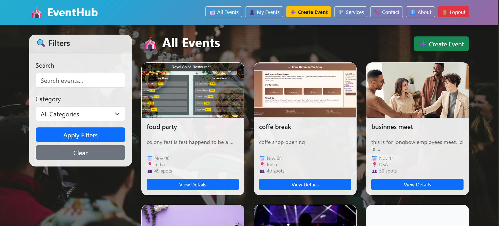
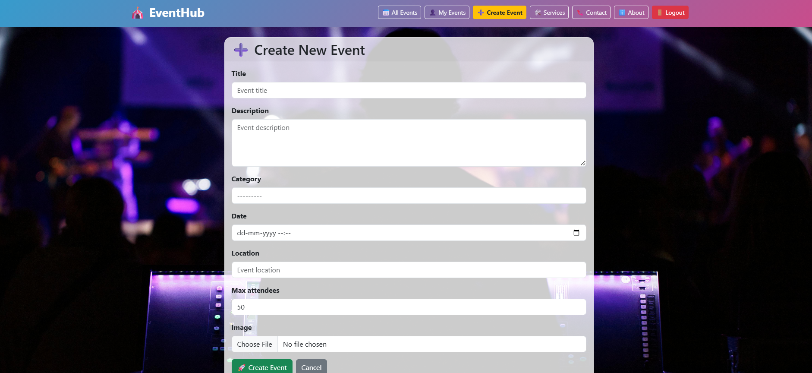

# 🎪 EventHub - Complete Event Management System

A full-stack Django web application with REST API for event management, featuring user authentication, event registration, and real-time capacity management.

## 🚀 Features

### 🌐 Web Application
- **👤 User Authentication** - Register, Login, Logout with session management
- **🎯 Event Management** - Create, Read, Update, Delete events with image uploads
- **📅 Event Registration** - Register/unregister for events with capacity tracking
- **🖼️ Image Handling** - Event images with automatic optimization
- **📱 Responsive Design** - Bootstrap-powered mobile-friendly UI
- **🎨 Modern UI** - Glass-morphism design with animated navigation

### 🔗 REST API
- **📡 Complete REST API** - All features available via API endpoints
- **🔐 API Authentication** - Token & Session authentication
- **📊 Real-time Data** - Live registration counts and availability
- **🔒 Race Condition Protection** - Database locking for concurrent registrations
- **🔍 Search & Filter** - API endpoints with search and category filtering

## 🛠️ Tech Stack

### Backend
- **Framework:** Django 5.2.7 + Django REST Framework 3.14.0
- **Database:** SQLite3 (Development) / PostgreSQL ready
- **Authentication:** Django Auth + Session Management
- **File Handling:** Pillow for image processing
- **Security:** CSRF protection, XSS protection

### Frontend
- **UI Framework:** Bootstrap 5.3.0
- **Styling:** Custom CSS with glass-morphism effects
- **Templates:** Django Template Language
- **Icons:** Emoji-based icon system

### API Features
- RESTful design with proper HTTP status codes
- JSON responses with consistent data structure
- Authentication via tokens and sessions
- Comprehensive error handling
- Rate limiting ready

## 📁 Project Structure

\## 🎯 Key Functionality
\-🔒 Race Condition Protection
 The application uses database-level locking (select_for_update()) to prevent overbooking when  multiple users register simultaneously for limited spots.

\### Event Management

\- Complete CRUD operations for events

\- Image upload and storage

\- Category-based event organization

\- Capacity tracking and registration limits

\### User System

\- Custom authentication flow

\- User-specific event tracking

\- Registration management

\- Session-based security

\### UI/UX Features

\- Responsive Bootstrap design

\- Glass-morphism card designs

\- Animated navigation bar

\- Background image system

\- 🔐 Security
    CSRF protection

    XSS prevention

    SQL injection protection

    Secure file uploads

\## 📸 Application Flow

1\. \*\*Home Page\*\* - Welcome with authentication options

2\. \*\*Authentication\*\* - Register/Login with validation

3\. \*\*Event Browsing\*\* - Filter and search events

4\. \*\*Event Creation\*\* - Organizers can create events with images

5\. \*\*Registration\*\* - Users can register for available events

6\. \*\*Management\*\* - Organizers can manage their events

## 📸 Screenshots

### Home Page (Before Login)

*Welcome page with login/register options - beautiful background design*

### Dashboard (After Login) 

*User dashboard with navigation to all features after successful login*

### All Events

*Browse all available events with search and category filters*

### My Events

*Manage events you're attending and events you're hosting*

### Create Event

*Form to create new events with image uploads and details*

\## 🔧 Technical Highlights

\- \*\*Django Class-Based Views\*\* - For event management

\- \*\*Model Relationships\*\* - User-Event-Registration connections

\- \*\*File Upload Handling\*\* - Image storage and serving

\- \*\*Form Validation\*\* - Custom form handling

\- \*\*Template Inheritance\*\* - DRY principle implementation

\## 👨‍💻 Developer

\*\*Preetham\*\*  

GitHub: \[preetham2203](https://github.com/preetham2203)

## ⚠️ LEGAL NOTICE

**COPYRIGHT PROTECTED - ALL RIGHTS RESERVED**

This project and all associated code are the intellectual property of Preetham. 
This repository is provided **FOR PORTFOLIO AND REVIEW PURPOSES ONLY**.

### 🔒 STRICTLY PROHIBITED:
- ❌ Commercial use
- ❌ Distribution or modification  
- ❌ Production deployment
- ❌ Claiming authorship

### ✅ PERMITTED USE:
- ✅ Review by potential employers
- ✅ Educational evaluation
- ✅ Recruitment assessment

**Unauthorized use will result in legal action.**

See [LICENSE](LICENSE) for complete terms and conditions.

---

**Developer:** Preetham  
**GitHub:** [preetham2203](https://github.com/preetham2203)  
**Status:** Copyright Protected - Portfolio Display
